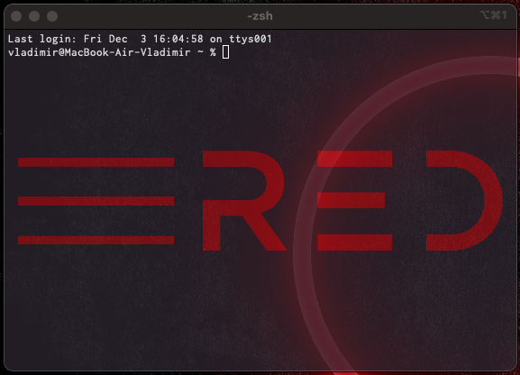
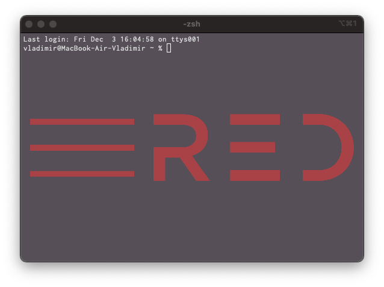

# 🎩 Red's ITerm profile (نمط سطر أوامر ريد) 

## How to setup?

To use this profile, you, maybe, will need to edit a path to the png(background). After that you will need to import it in ITerm's settings. Everything you need is in this repository.

## More photos?

